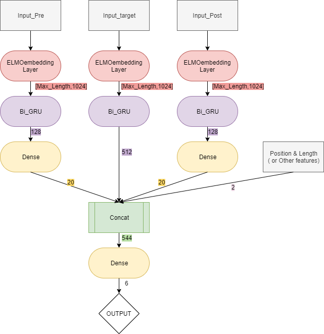
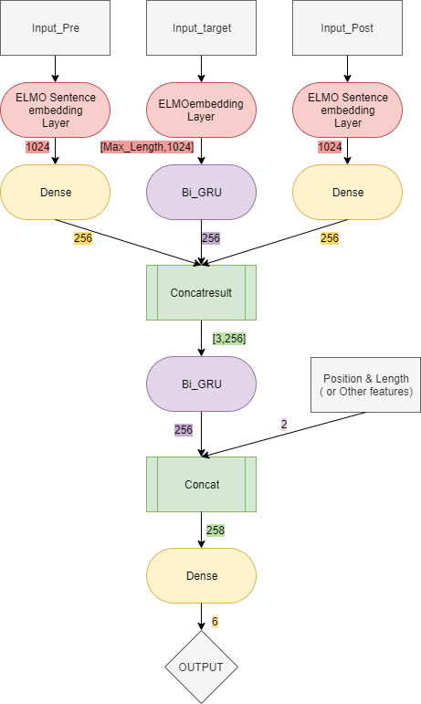
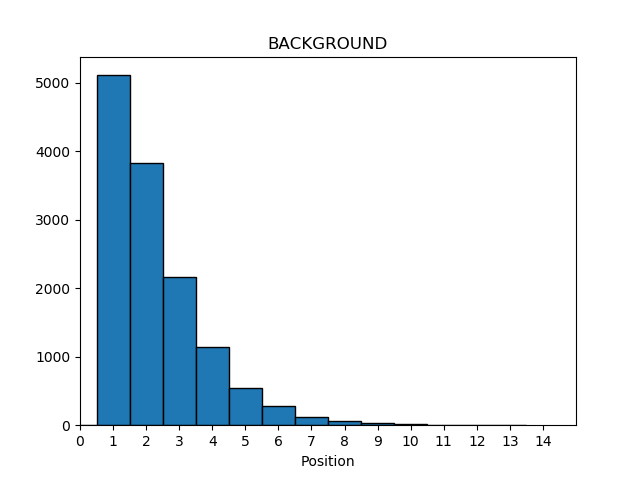
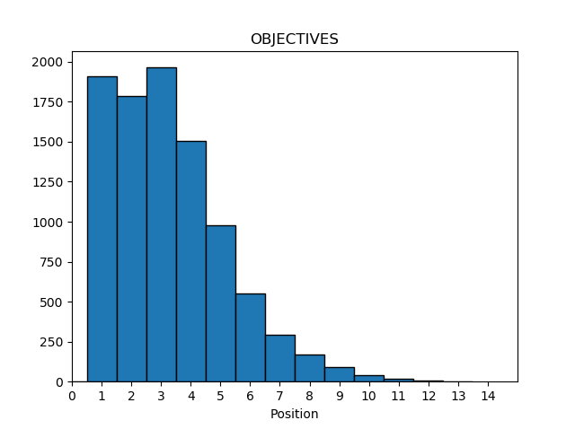
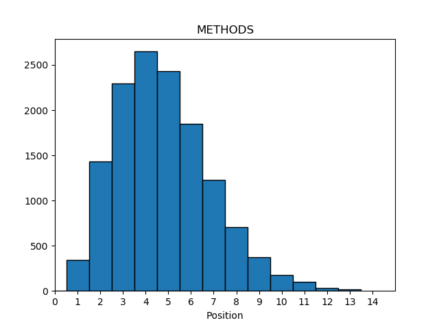
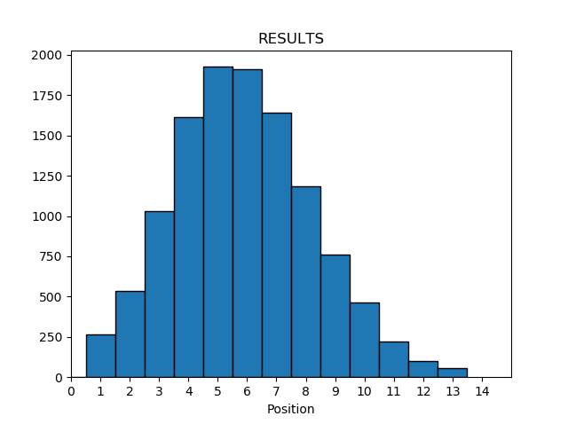
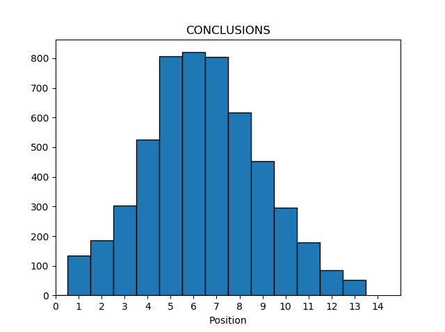
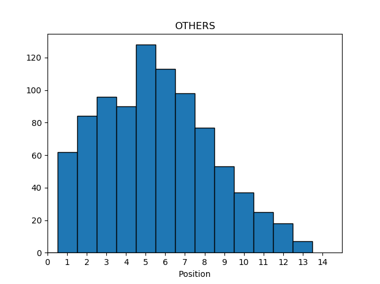
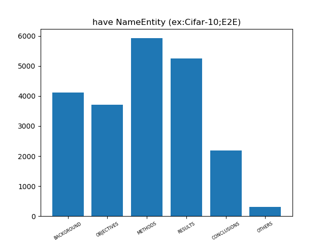
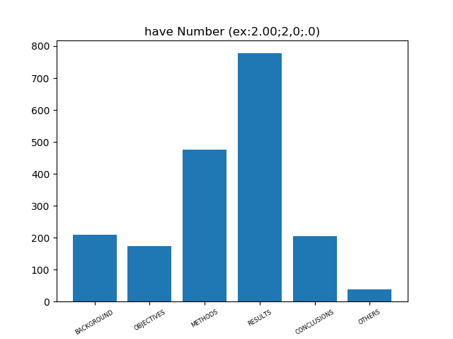

# Text Classification

This repository is based on this [Competition](https://tbrain.trendmicro.com.tw/Competitions/Details/8).

The task is trying to classify each sentences in the Abstract of the theses with the topic of Computer Science sourced from axXiv.
There are 6 categories: **Background**, **Objectives**, **Methods**, **Results**, **Conclusions** and **Others**.

---
## Data
* only *task1_trainset.csv* contains labels
* still provide testset but might be useless

---
## Python
Almost all the *.py* files are for preprocessing and extract the features. The model training and evaluation are in **Notebook**.

* Preprocessing 
    * GetAbstract.py: Get the structured data from the provided files.
    * CountPosition.py: Check the position of the sentences inside its source Abstract.
    * CheckNameNumber.py: Check if the sentence contains name entities or number.
    * Preprocessing.py: Text preprocessing. 3 cleaning punctuation functions are included. All of them using regular expression to remove some unwanted words or punctuation
    - Utility:
        * Combine_pre&post-sentence.py: Combine previous/next sentences of Target sentence together 
        * Combine_2pre&post-sentence.py: Combine first/last two sentences of Target sentence together 
        * Statistics.py: For data exploration
    - Useless files: 
        * Extract_Date.py: Extract the data of each thesis in the provided files as feature. (Not useful after my experience)
        * AdjustThreshold.py/ Submit.py: For competition submission
        * WordEmbedding.py: Embed each words in the sentences(after tokenize) using different pre-trained Word2Vec. Take lots of time and enormous resulting file. We should do wordembedding online during training. There's one more detailed guided instruction in **Notebook**

* Some Model that can be trained locally
    - TFIDF.py: Classifying the text using *TFIDF* as feature vectors and *xgboost* as classifier. There's one more detailed guided instruction in **Notebook**
    - CRF.py: Using *Conditional Random Field* as classifier. The sentence from same Abstract need to be combine together. The feature of each sentence is also TFIDF.
---
## Notebook
Some models (especially deep learning models) require lots of computing power, we can take the advantage of **Google Colab** as our computing resource. Notebooks also provide some detailed instruction.
* Tokenize.ipynb: How to preprocessing ans tokenize
* TFIDF.ipynb: How to use TFIDF as feature vectors (same as TFIDF.py)
* Spacy_embed.ipynb: How to conduct word embedding using Spacy (same as WordEmbedding.py)
* Deep_Averaging_Network(DAN).ipynb: Using DAN which is provided by TF-hub as features of the sentences. Then, use a naive Fully-Connected Neural Network as classifier
* BidirectionalRNN.ipynb: Build a Bidirectional GRU as classifier and word embedding of each words as representation of the sentences
* ELMO.ipynb: Using ELMO as embedded layer and Bi-GRU as classifier
* ELMO_with_pre_post_sentences.ipynb: **Best model**. Using ELMO as embedded layer and Bi-GRU as classifier. The input is:
    - previous/next sentences of target sentences&nbsp;&nbsp;&nbsp;&nbsp;&nbsp;&nbsp;or
    - first/last two sentences of target sentence
    - Model architecture: (Best performance is the ensemble of these two models)

        - **MODEL_1**

        

        - **MODEL_2**

        

## Some Features:
* Position of each label in its source Abstract
    - BACKGROUND

    

    - OBJECTIVES

    

    - METHODS

    

    - RESULTS

    

    - CONCLUSIONS

    

    - OTHERS

    

* Whether sentences with different labels contain Name Entity or Number
    - Name Entity

    

    - Number

    

